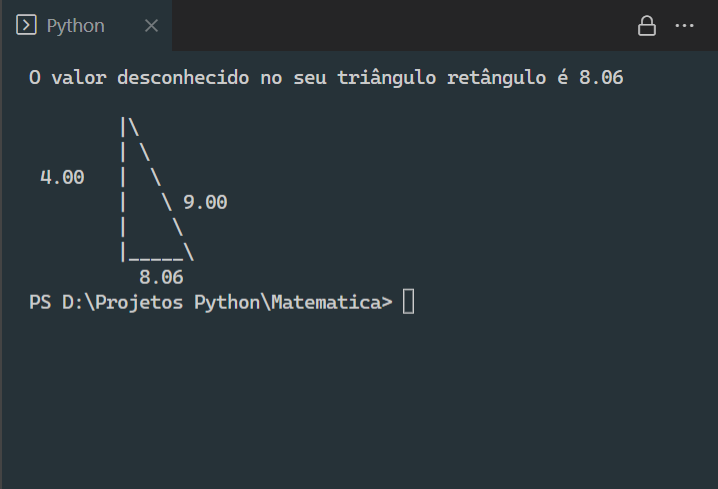
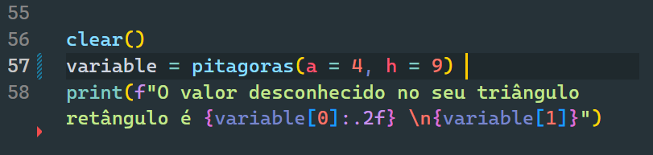

# Pitágoras 2.0

  
  

## 🎯 Propósito
O objetivo aqui foi aprimorar outro projeto meu, o <a href="https://github.com/MacS47/Teorema-de-Pitagoras">Teorema de Pitágoras</a>. O diferencial foi incluir uma visualização do triângulo com os respectivos valores.

## 🧠 Experiência/Motivação

### Status
* 07/2021 - Foram incluídos comentários ao código. 👌
* 05/2022 - Incluído README.md e LICENSE.md

## ✍ Como começar
Basta executar o arquivo _pitagoras.py_. Além de calcular o valor desconhecido no triângulo retângulo, uma figura com os valores da hipotenusa e dos catetos será exibida no terminal. Por padrão chamei a função `pitagoras(h, a, b)` com os valores de **cateto** e **hipotenusa**,  `a = 4` e `h = 9`. Conforme captura de tela abaixo:

 

Caso deseje testar com outros valores, basta alterar os parâmetros da função `pitagoras()` na linha 57:

 